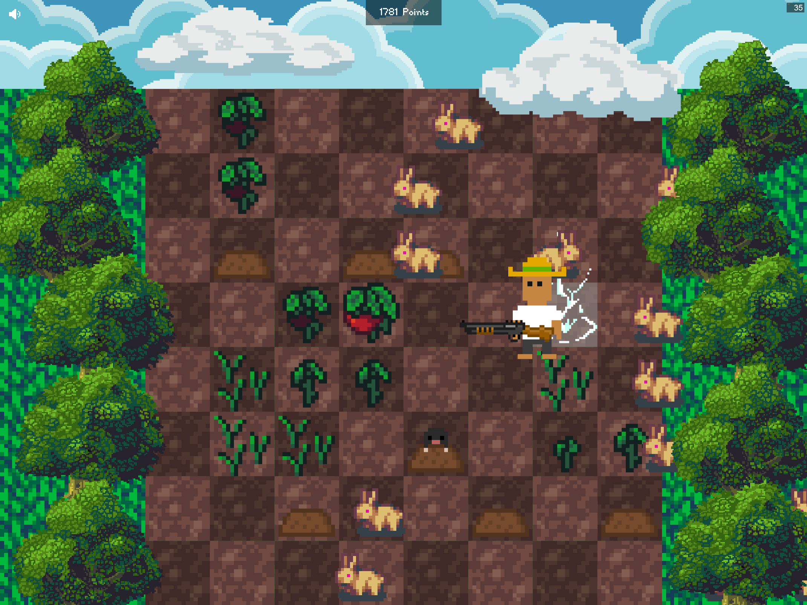

# Farm Siege

[🎮 PLAY NOW](https://farmsiege.wsky.dev)

Farm Siege is an engaging browser game that challenges players to grow and defend their crops under pressure, while striving to achieve the highest score possible.

Built entirely from scratch in TypeScript using a custom canvas game engine, which was strongly inspired by the Flutter syntax. Game logic is located in `/src`, engine code in `/lib`. Highscores are stored inside a Upstash Redis store.

